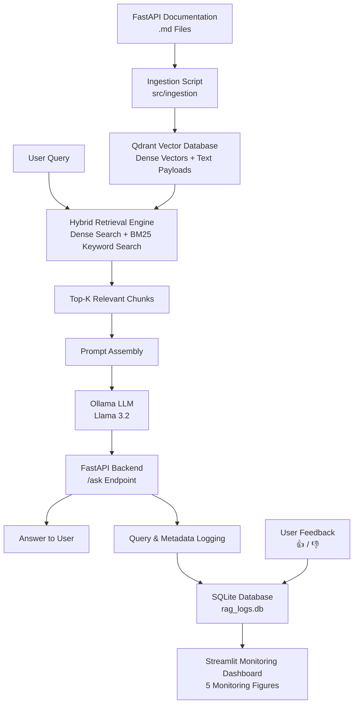

# DevDoc RAG — Project Implementation Plan

## 1. Project Overview & Scope
* **Project Name:** DevDoc RAG (FastAPI Documentation Assistant)
* **LLM Engine:** Local Ollama (`llama3.2` or `mistral`)
* **Vector & Text Storage:** Qdrant (supports Dense Vector + Sparse BM25 / Keyword search)
* **Interface:** FastAPI Backend (Interactive Swagger UI `/docs` + REST endpoints)
* **Ingestion:** Automated Python ingestion scripts
* **Monitoring:** User feedback collection + Streamlit monitoring dashboard (5+ analytical charts)
* **Target Points:** 13–14 Points (Passing threshold: 11 points)

---

## 2. Target Rubric Scorecard

| Rubric Category | Target Points | Implementation Details |
| :--- | :---: | :--- |
| **Problem Description** | 2 / 2 | Clear context, developer pain points, and architecture documentation in README. |
| **Retrieval Flow** | 2 / 2 | Fully integrated Qdrant knowledge base + Ollama LLM response generation. |
| **Retrieval Evaluation** | 2 / 2 | Evaluation of Vector vs. Text/BM25 vs. Hybrid search on Hit Rate & MRR. |
| **LLM Evaluation** | 2 / 2 | Comparison of 2+ prompt templates evaluated via LLM-as-a-Judge. |
| **Interface** | 2 / 2 | FastAPI service with `/ask`, `/feedback`, and Swagger UI documentation. |
| **Ingestion Pipeline** | 1 / 2 | Python ingestion script parsing markdown docs and uploading to Qdrant. |
| **Monitoring** | 2 / 2 | Streamlit dashboard reading from SQLite log database with ≥5 metrics/charts. |
| **Containerization** | 0 / 2 | Local execution (no Docker). |
| **Reproducibility** | 2 / 2 | Clear reproduction instructions, fixed `uv.lock` / dependencies, and mock data. |
| **Best Practices** | +1 | Hybrid search (Dense Vector + Sparse/Keyword BM25 fusion). |
| **Total Estimated Score** | **15 / 19** | **Comfortably exceeds passing grade** |

---

## 3. Architecture & Data Flow

The system follows a **Retrieval-Augmented Generation (RAG)** architecture that combines dense vector search and BM25 keyword search to retrieve relevant FastAPI documentation before generating an answer with a local LLM.



### Data Flow

1. **Documentation Ingestion**
   FastAPI documentation stored as Markdown (`.md`) files is processed by the ingestion pipeline.

2. **Vector Storage**
   The documents are split into chunks, converted into dense embeddings, and stored in **Qdrant** together with their original text as payloads.

3. **Hybrid Retrieval**
   When a user submits a query, the retrieval engine combines:

   * **Dense vector search** for semantic similarity.
   * **BM25 keyword search** for exact keyword matching.

4. **Top-K Retrieval**
   The most relevant document chunks are selected and passed to the prompt assembly stage.

5. **Prompt Assembly**
   The retrieved context is combined with the user's question to construct the final prompt.

6. **LLM Generation**
   The assembled prompt is sent to **Llama 3.2**, running locally through **Ollama**, to generate the answer.

7. **FastAPI Backend**
   The generated response is returned through the `/ask` API endpoint.

8. **Logging & Feedback**
   Query information and metadata are stored in a SQLite database (`rag_logs.db`). User feedback through **👍 / 👎** is also recorded.

9. **Monitoring**
   The stored logs are visualized through a **Streamlit monitoring dashboard**, providing five figures for analyzing system usage and performance.

---

## 4. Step-by-Step Execution Plan

### Phase 1: Data Acquisition & Structural Chunking
- [ ] Clone or extract the official FastAPI documentation Markdown files into `data/raw/`.
- [ ] Write `src/ingestion/chunker.py` to parse Markdown files hierarchically using heading levels (`#`, `##`, `###`).
- [ ] Preserve code blocks inside their parent context and extract metadata (`file_path`, `section_title`, `url`).
- [ ] Output structured JSON chunks into `data/processed/chunks.json`.

### Phase 2: Ground-Truth Dataset Generation
- [ ] Sample 30–40 chunks across different topics (routing, dependency injection, security, middleware).
- [ ] Run `src/evaluation/generate_ground_truth.py` using Ollama to create `{"question", "doc_id", "ground_truth_answer"}` pairs.
- [ ] Save the generated benchmark to `data/ground_truth.json`.

### Phase 3: Ingestion into Qdrant
- [ ] Write `src/ingestion/ingest_qdrant.py` to:
  - Initialize local Qdrant (in-memory or local path `data/qdrant_storage`).
  - Create dense vector embeddings using `sentence-transformers/all-MiniLM-L6-v2` or Ollama's `nomic-embed-text`.
  - Store text payloads and payload indices for keyword/BM25 search.
  - Ingest all chunks.

### Phase 4: Hybrid Search & Retrieval Evaluation
- [ ] Implement three retrieval functions in `src/retrieval/search.py`:
  1. `vector_search(query, k)`
  2. `text_search(query, k)`
  3. `hybrid_search(query, k)` (combining vector similarity and keyword scoring via Reciprocal Rank Fusion / linear weighting).
- [ ] Write `src/evaluation/evaluate_retrieval.py` to calculate:
  - **Hit Rate @ k** (k=3, 5)
  - **MRR (Mean Reciprocal Rank)**
- [ ] Export results to a Markdown comparison table in `README.md`.

### Phase 5: Prompt Engineering & LLM Evaluation
- [ ] Create two prompt variations in `src/generation/prompts.py`:
  - **Prompt A:** Simple direct context RAG prompt.
  - **Prompt B:** Structured technical assistant prompt with explicit rules for code examples, documentation section citations, and conciseness.
- [ ] Run `src/evaluation/evaluate_llm.py` with an LLM-as-a-Judge script to score 20 samples on:
  - **Answer Faithfulness** (1–5)
  - **Answer Relevance** (1–5)
- [ ] Record the winning prompt configuration.

### Phase 6: FastAPI Backend & Feedback Logging
- [ ] Build `src/app/main.py` using FastAPI with endpoints:
  - `POST /ask`: Accepts `{"query": "..."}`, runs hybrid retrieval + Ollama generation, records generation time, and logs to `rag_logs.db`.
  - `POST /feedback`: Accepts `{"log_id": "...", "rating": 1 or -1, "comment": "..."}` and updates the record in `rag_logs.db`.
  - `GET /health`: Health-check endpoint verifying Qdrant and Ollama connectivity.
- [ ] Enable Swagger UI at `http://localhost:8000/docs`.

### Phase 7: Streamlit Monitoring Dashboard (≥5 Charts)
- [ ] Build `src/app/dashboard.py` in Streamlit connecting to `rag_logs.db`.
- [ ] Implement the required 5 analytical visualizations:
  1. **Total Queries Over Time** (Line chart: hourly / daily request count).
  2. **User Feedback Breakdown** (Pie / Bar chart: % Thumbs Up vs. Thumbs Down).
  3. **Response Latency Distribution** (Histogram: P50, P90, P99 in milliseconds).
  4. **Top Retrieved Documentation Sections** (Bar chart: most frequently queried topics).
  5. **Estimated Token / Response Length Distribution** (Box plot / Histogram).

### Phase 8: Documentation & Verification
- [ ] Complete `README.md` following the course rubric:
  - Problem Statement & Architecture Diagram.
  - Retrieval & LLM Evaluation Comparison Tables.
  - Clear reproduction steps (`uv sync`, run ingestion, run FastAPI, run dashboard).
- [ ] Test the entire flow from a clean clone to ensure 100% reproducibility.

---

## 5. Repository File Structure

```text
devdoc-rag/
├── data/
│   ├── raw/                  # Downloaded markdown documentation
│   ├── processed/            # Parsed JSON chunks
│   ├── ground_truth.json     # 30-40 Q&A benchmark pairs
│   └── rag_logs.db           # SQLite feedback & telemetry log
├── src/
│   ├── __init__.py
│   ├── ingestion/
│   │   ├── chunker.py        # Markdown header-based chunking
│   │   └── ingest_qdrant.py  # Python ingestion script for Qdrant
│   ├── retrieval/
│   │   └── search.py         # Vector, BM25, and Hybrid RRF search
│   ├── generation/
│   │   ├── prompts.py        # Prompt templates
│   │   └── ollama_client.py  # Ollama API interface
│   ├── evaluation/
│   │   ├── generate_ground_truth.py
│   │   ├── evaluate_retrieval.py
│   │   └── evaluate_llm.py
│   └── app/
│       ├── main.py           # FastAPI service & feedback endpoints
│       └── dashboard.py      # Streamlit monitoring dashboard
├── .env.example
├── .gitignore
├── pyproject.toml
├── uv.lock
└── README.md